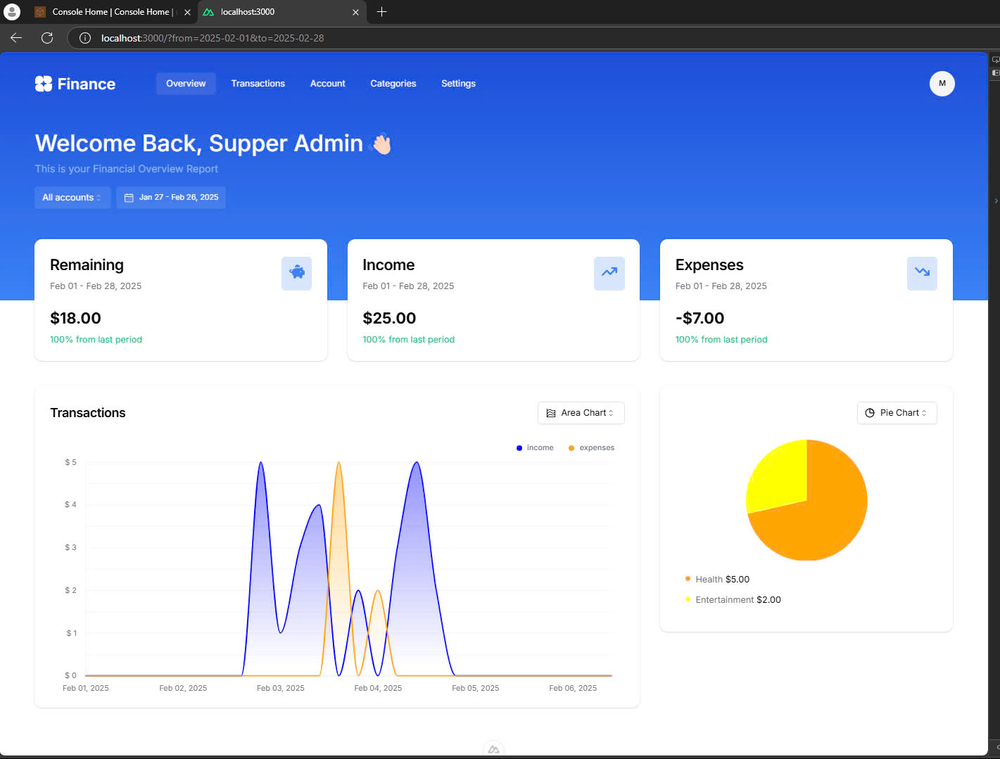
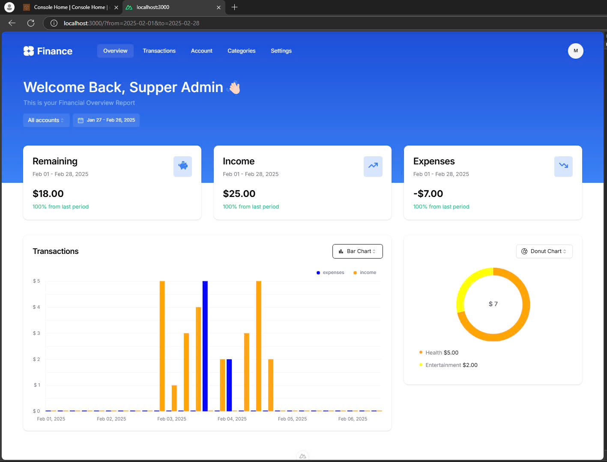
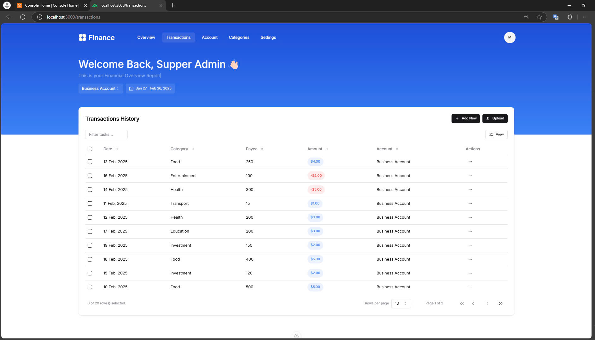
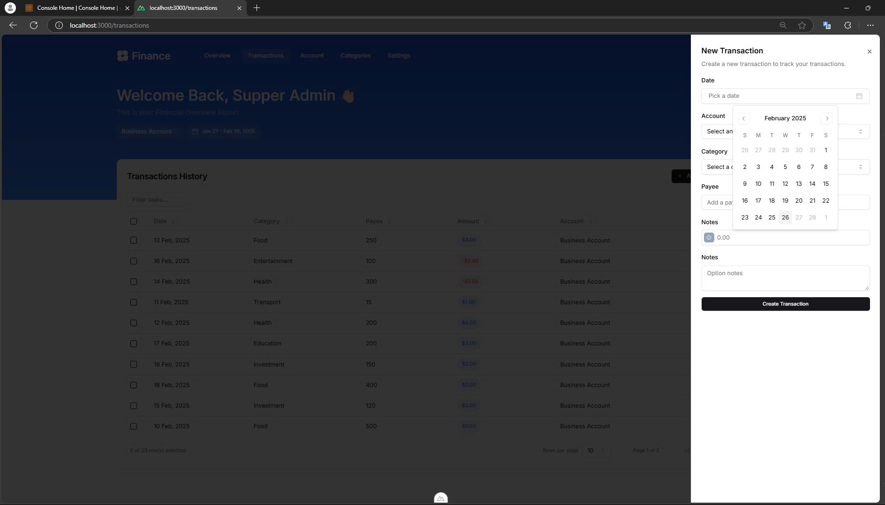
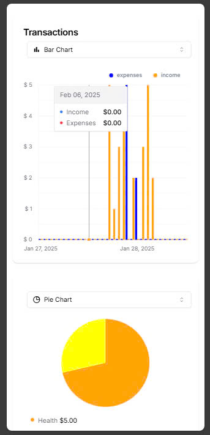
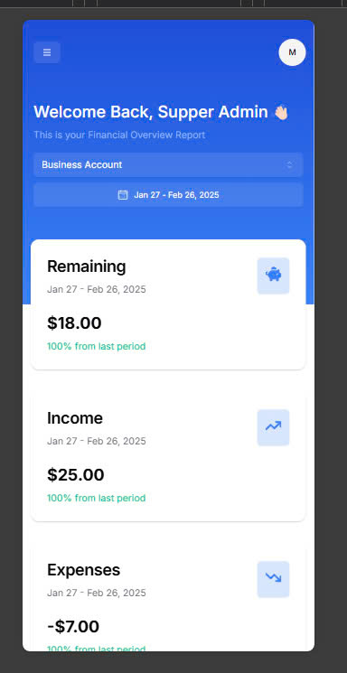
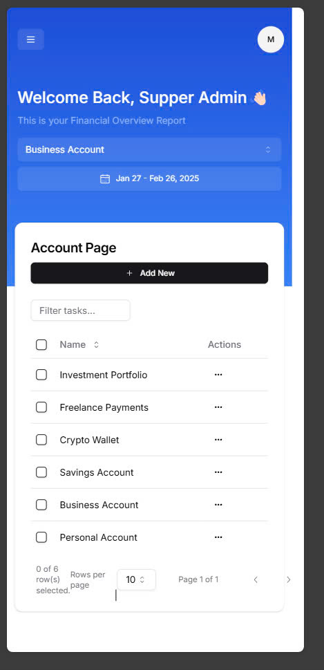
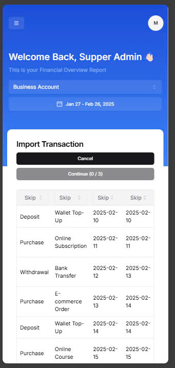
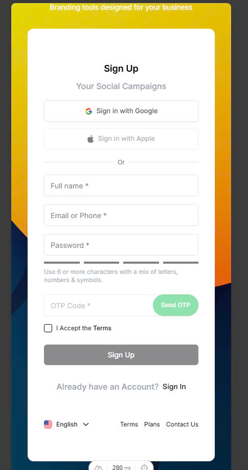

# Finance Management App

## Overview

A simple finance management app built with **Nuxt.js**, allowing users to track expenses, manage accounts, and analyze spending through reports and charts.

## Features

- **Accounts**: Create and manage multiple accounts (Cash, Bank, E-Wallets, etc.).
- **Categories**: Organize transactions into categories (Food, Shopping, Salary, etc.).
- **Transactions**: Add, edit, and delete income/expense records with descriptions and timestamps.
- **Reports & Analytics**: View spending summaries with charts and balance history.
- **Import CSV Data**: Quickly import transaction data from CSV files.


## Demo Video

<video controls width="100%">
  <source src="https://www.youtube.com/watch?v=6qaSh86tZ24" type="video/mp4">
  Your browser does not support the video tag.
</video>

## Screenshots

<div style="display: flex; flex-wrap: wrap; gap: 10px; justify-content: center;">
  
  
  
  
  
  
  
  
  
  
</div>

## Tech Stack

- **Frontend**: Nuxt.js (Vue.js)
- **State Management**: Pinia
- **Database**: MongoDB
- **Backend**: Node.js (NestJS / Express)
- **Authentication**: JWT, Firebase
- **UI Framework**: Tailwind CSS / Shadcn

## Setup

```bash
git clone https://github.com/your-repo/finance-management.git
cd finance-management
npm install
npm run dev
```
